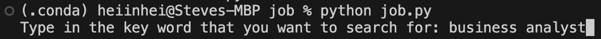
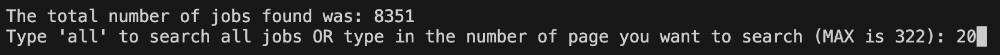
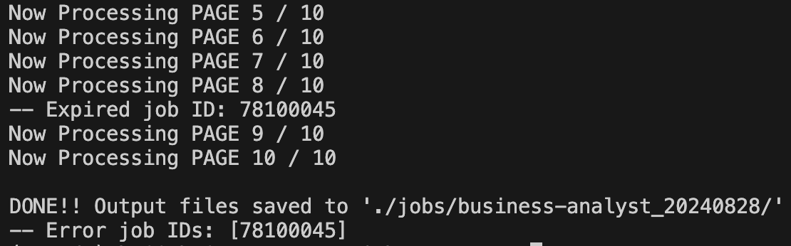
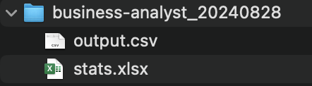

# JobDB Job Scraper (Part I)

**Click [here](https://github.com/heiinhei911/job-insights) to see Part II.**

**DISCLAIMER: This project and its data are intended for educational purposes only.**

This is a customizable web scraper for full-time jobs on JobsDB.com HK with in-depth analysis.

This project is split into two parts: the **Job Scraper** _(this project)_ and the **Data Analysis** using the data scraped from the first part.

# Part I - Job Scraper

The program in this part scrapes for full-time jobs that are found under a particular keyword on JobsDB.com HK and stores the scraped data in a csv.

## How to Use

### Setting up the Environment

1.  Clone the respository to your local machine. One way to do it is to pick a location on your local machine where you want the respository to clone to (e.g., the desktop) and type `git clone https://github.com/heiinhei911/job-insights.git` into the terminal
2.  Change your current directory `cd` to the location of the cloned respository on your local machine (e.g., `cd Desktop/job-insights`)
3.  _(Optional)_ Create a virtual environment for the cloned respository (e.g., venv, conda)
4.  _(Under the virtual env. if you have created one in step 3)_ Type `pip install -r requirements.txt`. This will install all the necessary packages and modules so that the program can run properly

### Using the Program

1.  Run the program by running `python job-scraper.py` in the terminal
2.  Enter the keywords that you would like to search for (e.g., business analyst)

    

3.  Enter the number of pages that you would like to search for
    (you can either type in a number for searching a set number of pages OR type in 'all' for searching all pages)

    

4.  Now we wait!

    _(This step could take quite a while depending on a number of factors such as the number of job postings you are scraping, your internet speed, the specification of your machine, etc.)_

5.  Once all the pages have been processed, all the data will be saved in a `[the keyword you have inputted in step 2] + [today's date]/` folder under the `jobs/` directory

    

# Output Files

After the scraping has been completed, you will find two files under the newly created folder: **output.csv** and **stats.xlsx**.

The **output** CSV contains all the scraped data related to your keywords. This includes _Title, Company, Years of Experience Required, Location, Salary_, etc. of a job.

The **stats** Excel file contains two sheets:

- the first sheet (named _"Common_Word_Freq"_) is 50 of the most frequently occurring common words from all the scraped job descriptions, along with their frequency count
- the second sheet (named _"Org_Word_Freq"_) is a summary of all the most frequently occurring words from all scraped job descriptions that correspond to the "ORG" named entity in SpaCy (in other words, these words are commonly associated with companies, agencies, institutions, etc.), along with their frequency count

  _(The frequency counts in both sheets have been arranged in an descending order)_

# Libraries/Frameworks Used

Part I - Job Scraper: Python, Beautiful Soup, Selenium, Pandas, Scikit-learn, Spacy

# Credits

All data come from JobsDB.com HK. All rights reserved to JobsDB.com HK.
